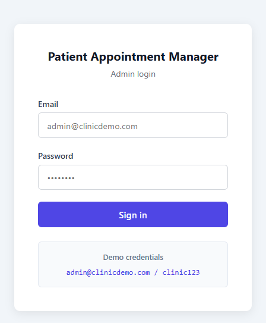
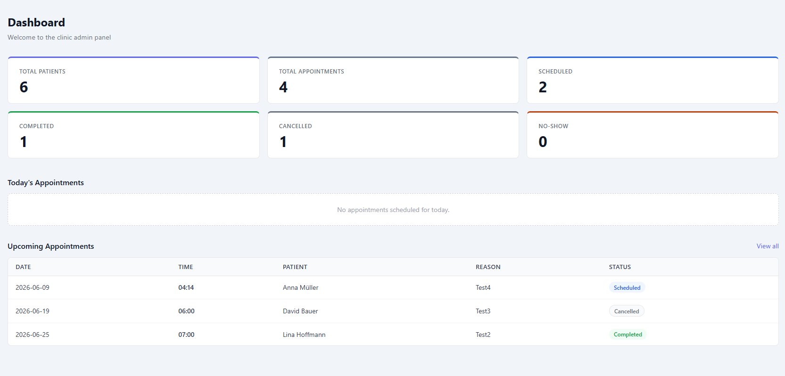
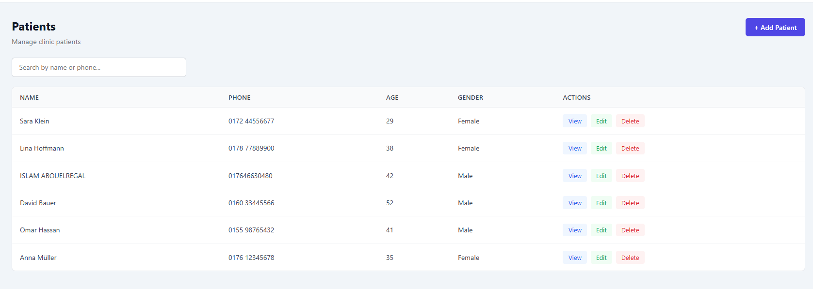
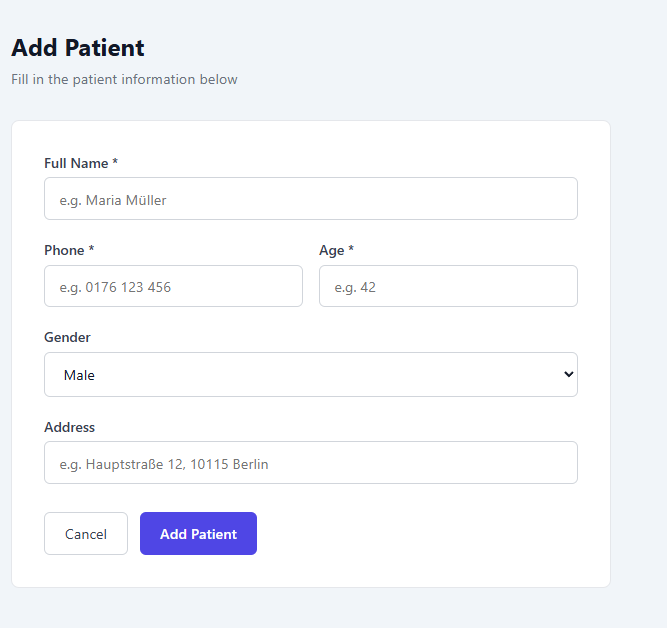
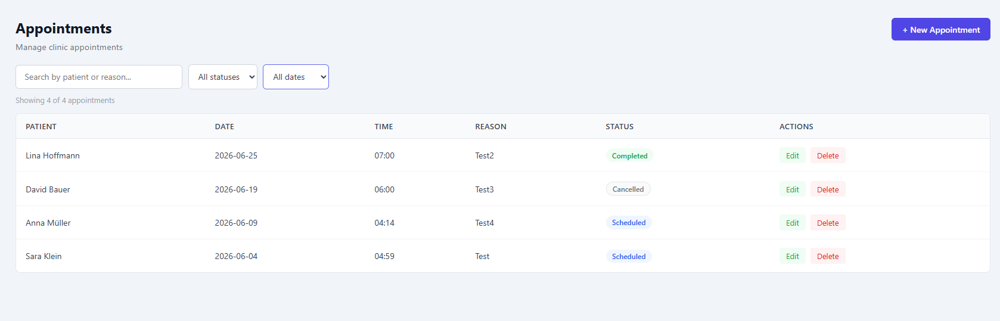
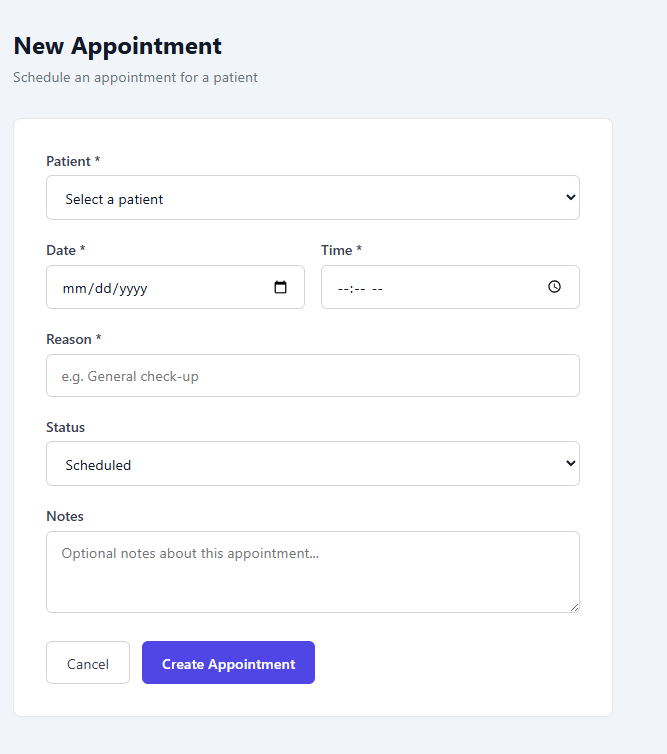

# Patient Appointment Manager

A small educational portfolio project built with **Next.js**, **React**, **TypeScript**, and **Firebase**.

The project simulates a simple patient appointment management system. It helps organize patients, appointments, appointment status, and basic medical visit information in a structured dashboard.

This project was built mainly for learning and portfolio practice, especially to combine my interest in software development with my previous healthcare background.

---

## Screenshot

### Login Page



### Dashboard



### Patients Page





### Appointments Page





---

## Features

### Patient Management

* Add patient information
* View patients in a structured list
* Edit patient details
* Delete patient records
* Search patients by name
* Store basic patient information such as name, phone number, age, and notes

### Appointment Management

* Create new appointments
* Select appointment date and time
* Assign appointments to patients
* Add appointment reason or notes
* Update appointment status
* Delete appointments
* View upcoming appointments
* Filter appointments by status or date

### Dashboard

* Overview of total patients
* Overview of total appointments
* Display upcoming appointments
* Display appointment status summary
* Simple and clear user interface
* Responsive layout for desktop and mobile

### Authentication

* Protected dashboard using Firebase Authentication
* Login page for accessing the system
* Basic protected routes for authenticated users

---

## Tech Stack

* Next.js
* React
* TypeScript
* Firebase Firestore
* Firebase Authentication
* CSS Modules / Tailwind CSS
* Git / GitHub

---

## Project Structure

```text
patient-appointment-manager/
├── app/
│   ├── appointments/
│   │   └── page.tsx
│   ├── patients/
│   │   └── page.tsx
│   ├── login/
│   │   └── page.tsx
│   ├── layout.tsx
│   └── page.tsx
│
├── components/
│   ├── AppointmentForm.tsx
│   ├── AppointmentList.tsx
│   ├── DashboardCard.tsx
│   ├── Header.tsx
│   ├── PatientForm.tsx
│   └── PatientList.tsx
│
├── context/
│   └── AuthContext.tsx
│
├── lib/
│   ├── auth.ts
│   ├── firebase.ts
│   ├── appointments.ts
│   └── patients.ts
│
├── styles/
├── types/
│   ├── appointment.ts
│   └── patient.ts
│
├── .env.example
├── .gitignore
├── README.md
├── next.config.ts
├── package.json
└── tsconfig.json
```

---

## Available Pages

```text
/               Dashboard page
/login          Login page
/patients       Patient management page
/appointments   Appointment management page
```

---

## Demo Admin Login

The admin dashboard is protected with Firebase Authentication.

---
## You can visit it:

https://patientappointment.islamalbadawy.com/

---
Demo credentials:

```text
User: admin@clinicdemo.com  
Password: clinic123
```
---

## What I Practiced in This Project

* Creating a Next.js project with TypeScript
* Building reusable React components
* Managing forms and user input
* Reading and writing data with Firebase Firestore
* Using Firebase Authentication
* Protecting dashboard pages
* Creating patient and appointment data models
* Implementing basic CRUD operations
* Working with appointment status logic
* Search and filter functionality
* Responsive layout
* Organizing a practical frontend project
* Writing clean and understandable code

---

## Notes

This project is built for educational and portfolio purposes.

It is not a real medical system and should not be used for storing real patient data.
For a real healthcare application, more security and compliance features would be required, such as:

* Strong authentication and authorization
* User roles and permissions
* Data encryption
* Detailed audit logs
* Stronger Firestore security rules
* Better validation
* Privacy and data protection compliance

---

## Possible Future Improvements

* Add role-based access for admin and staff users
* Add appointment reminders
* Add calendar view
* Add patient visit history
* Add file upload for medical documents
* Add advanced search and filters
* Add statistics and reports
* Add dark mode
* Add better form validation
* Add unit tests
* Improve Firestore security rules

---

## Project Goal

The goal of this project is not to build a complete healthcare system, but to create a small and understandable appointment management application.

It helped me practice TypeScript, Next.js, Firebase, CRUD operations, authentication, and building a realistic dashboard-style application.

This project is suitable as a beginner-to-intermediate portfolio project, especially for showing practical software development skills in an administrative or healthcare-related use case.

---

## Author

**Islam Albadawy**
Aspiring Software Developer
